# VECTRA — Vehicle-Edge-Coordination Transformer with Routed Attention

> **V**ehicle-**E**dge-**C**oordination **T**ransformer with **R**outed **A**ttention  
> A Feature-Disentangled Graph-MoE MARL framework for Dynamic Vehicle Routing with Time Windows (DVRPTW)

---

## Table of Contents

1. [Problem Formulation](#1-problem-formulation)
2. [Core Assumptions](#2-core-assumptions)
3. [Mathematical Analysis](#3-mathematical-analysis)
   - 3.1 [Computational Complexity](#31-computational-complexity)
   - 3.2 [Solution Quality Preservation](#32-solution-quality-preservation)
   - 3.3 [Cross-Scale Generalisation](#33-cross-scale-generalisation)
4. [Architecture Overview](#4-architecture-overview)
5. [Component Details](#5-component-details)
   - 5.1 [VECTRA Graph Encoder](#51-vectra-graph-encoder--feature-disentangled-anisotropic-graph-transformer)
   - 5.2 [Latent Bottleneck](#52-latent-bottleneck)
   - 5.3 [Fleet Encoder & Coordination Memory](#53-fleet-encoder--coordination-memory)
   - 5.4 [Edge Feature Encoder](#54-edge-feature-encoder)
   - 5.5 [Cross-Edge Fusion](#55-cross-edge-fusion)
   - 5.6 [Ownership Head](#56-ownership-head)
   - 5.7 [Lookahead Head](#57-lookahead-head)
   - 5.8 [Situation-Aware MoE Score Fusion](#58-situation-aware-moe-score-fusion)
   - 5.9 [Candidate Shortlist (SBG)](#59-candidate-shortlist-sbg)
   - 5.10 [Adaptive Depth](#510-adaptive-depth)
6. [Training Objective](#6-training-objective)
7. [Inference Flow](#7-inference-flow)
8. [Configuration Reference](#8-configuration-reference)
9. [Quickstart](#9-quickstart)

---

## 1. Problem Formulation

DVRPTW is modelled as a **Sequential Multi-agent Markov Decision Process (sMAMDP)**.  
At each decision step exactly **one** vehicle acts; the others wait or travel.

| Symbol | Meaning |
|---|---|
| $\mathcal V = \{v_1,\dots,v_M\}$ | Fleet of $M$ vehicles |
| $\mathcal C_t = \{c_1,\dots,c_{L_t}\}$ | Known customer set at time $t$ (grows dynamically) |
| $s_t$ | Global state: positions, loads, current times, TW, dynamic arrivals |
| $a_t \in \mathcal C_t \cup \{\text{depot}\}$ | Action of the acting vehicle |
| $r_t$ | Reward: negative travel distance, lateness penalty |
| $\pi_\theta$ | Stochastic policy parameterised by $\theta$ |

**Objective:**

$$\max_\theta \; \mathbb{E}_{\pi_\theta}\!\left[\sum_{t=0}^{T} r_t\right]$$

---

## 2. Core Assumptions

The following assumptions underpin the theoretical guarantees developed in §3.

**A1 — Feature boundedness.**  
All input features (coordinates, demands, time windows, vehicle states) are normalised to a bounded domain $\mathcal X \subset \mathbb R^d$ with $\|\mathbf x\|_\infty \le 1$.

**A2 — Lipschitz scoring.**  
The compatibility scorer $q_\theta : \mathcal X \to \mathbb R$ is $L_q$-Lipschitz with respect to the $\ell_2$ norm of its inputs.

**A3 — High-recall shortlist.**  
The cheap pre-filter (SBG) retains the optimal action $a^*$ in its shortlist of size $K$ with probability at least $1 - \delta$, where $\delta$ is small.

**A4 — Bounded approximation error.**  
The scorer's approximation error relative to the full dense scorer satisfies $\|\hat q - q\|_\infty \le \varepsilon$ uniformly on the shortlist.

**A5 — Scale-invariant features.**  
Coordinate and distance features are normalised per instance, making the feature distribution weakly dependent on the number of customers $L_c$.

---

## 3. Mathematical Analysis

### 3.1 Computational Complexity

Let $D$ = number of encoder layers, $d$ = model dimension, $L_c$ = number of customers,
$M$ = latent bottleneck tokens, $K$ = shortlist size, $k$ = KNN neighbourhood size.

| Module | Complexity |
|---|---|
| VECTRA Graph Encoder (per layer, KNN-masked) | $O(L_c k d + L_c^2 R)$ where $R=6$ |
| Latent Bottleneck cross-attention | $O(L_c M d)$ |
| Fleet Encoder (per vehicle, per layer) | $O(L_v L_c d)$ |
| SBG candidate selection | $O(L_c)$ |
| Deep scoring on shortlist | $O(K d)$ |

**Total per decision step with adaptive depth $\bar D \le D$:**

$$\boxed{T_{\text{VECTRA}} = O\!\Big(\bar D\bigl(L_c k d + L_c M d\bigr) + K d\Big)}$$

Compared to the dense baseline:

$$T_{\text{dense}} = O\!\Big(D \cdot L_c^2 d\Big)$$

When $k, M, K \ll L_c$ and $\bar D \le D$, **VECTRA scales near-linearly** in $L_c$, whereas the dense baseline is quadratic.

**Corollary.** For fixed $k=15$, $M=32$, $K=16$, $\bar D = D/2$:

$$\frac{T_{\text{VECTRA}}}{T_{\text{dense}}} \approx \frac{(k+M)}{L_c} \cdot \frac{\bar D}{D} \xrightarrow{L_c\to\infty} 0$$

### 3.2 Solution Quality Preservation

**Proposition.** Under assumptions A1–A4, let $\gamma = q_{(1)} - q_{(2)}$ be the logit margin between the best and second-best candidate. If $\varepsilon < \gamma/2$, the argmax action is preserved:

$$\hat a^* = \arg\max_{j \in \mathcal S_K} \hat q_j = a^* \quad \text{whenever } a^* \in \mathcal S_K.$$

**Proof.** For any $j \neq a^*$ in the shortlist:

$$\hat q_{a^*} \ge q_{a^*} - \varepsilon > q_j + \gamma - \varepsilon > \hat q_j + \gamma - 2\varepsilon > \hat q_j$$

since $\varepsilon < \gamma/2$. $\square$

**Rollout quality bound.** Over a trajectory of $T$ steps, by union bound over shortlist misses and scoring errors:

$$\mathbb{E}[\Delta J] \le T\bigl(\delta \cdot \Delta_{\max} + \kappa \varepsilon\bigr)$$

Reducing $\delta$ (better shortlist filter) and $\varepsilon$ (better distillation) drives $\Delta J \to 0$.

### 3.3 Cross-Scale Generalisation

**Proposition.** Under A2 and A5, for instances of sizes $n$ and $m$ with feature distributions $\mu_n, \mu_m$:

$$\|\pi_n - \pi_m\|_{\mathrm{TV}} \le L_\pi \, W_1(\mu_n, \mu_m) + \xi$$

where $W_1$ is the Wasserstein-1 distance and $\xi > 0$ is reduced by the **multi-scale consistency loss** (see §6).

**Implication.** Curriculum training $n=20 \to 50 \to 100$ is theoretically stable: the policy TV-distance between consecutive scales is bounded by the distributional shift $W_1(\mu_n, \mu_m)$ plus residual training error.

---

## 4. Architecture Overview

```
INPUT: customers C_t (x,y,demand,tw_s,tw_e,svc,arr), vehicles V, dynamic arrivals
         │
         ▼
┌─────────────────────────────────────────────────────────────────┐
│                 STEP 1: Customer Encoding                       │
│   Depot + Customer Embeddings (Linear)                          │
│   ──► NodeStructuralEncoding (centrality, TW urgency,           │
│        TW midpoint, demand significance → D)                    │
│   ──► VECTRAPairwiseFeatures (spatial, temporal, demand → 6D)   │
│   ──► VECTRA Graph Encoder (Disentangled MHA + Edge Values)     │
│        • Spatial heads ← distance bias                          │
│        • Temporal heads ← TW overlap/precedence bias            │
│        • Demand heads ← demand diff/load bias                   │
│        • Cross heads ← all-feature bias                         │
│        • Edge-valued messages: out += σ(g)·W_e·e_ij             │
│   ──► [optional Latent Bottleneck, M tokens]                    │
│   ──► Dropout + Linear project → cust_repr  N×Lc×D              │
└─────────────────────────────────────────────────────────────────┘
         │
         ▼
┌─────────────────────────────────────────────────────────────────┐
│       STEP 2: Vehicle Context + Coordination Memory             │
│   Fleet Encoder (cross-att on cust_repr)                       │
│   CoordinationMemory (per-vehicle GRU-like state)               │
│   ──► veh_repr  N×1×D                                          │
└─────────────────────────────────────────────────────────────────┘
         │
         ▼
┌─────────────────────────────────────────────────────────────────┐
│            STEP 3: Edge Feature Construction                    │
│   dist, travel_time, arrival, wait, late,                       │
│   slack, feasibility, cap_gap                                   │
│   ──► EdgeFeatureEncoder → edge_emb  N×1×Lc×D                  │
└─────────────────────────────────────────────────────────────────┘
         │
         ▼
┌─────────────────────────────────────────────────────────────────┐
│            STEP 4: SBG Candidate Shortlist                      │
│   cheap_score = -dist - λ·late + μ·slack + ω·owner             │
│   Select top-K feasible candidates → cand_idx                   │
└─────────────────────────────────────────────────────────────────┘
         │
         ▼
┌─────────────────────────────────────────────────────────────────┐
│            STEP 5: Deep Scoring on Shortlist                    │
│   CrossEdgeFusion  → att_score                                  │
│   OwnershipHead    → owner_bias                                 │
│   LookaheadHead    → look_score                                 │
│            │  z-normalise each stream → (N,1,L,3)               │
│            ▼                                                    │
│   ┌── AdaptiveExpertScoreFusion (MoE) ──────────────────┐       │
│   │  K=4 Expert MLPs (scores→hidden→scalar)             │       │
│   │  Situation Gate: [veh_repr‖graph_ctx] → K logits    │       │
│   │  Candidate Gate: scores + edge_emb → K logits       │       │
│   │  α·sit_gate + (1-α)·cand_gate → soft routing        │       │
│   │  Σ_k gate_k · expert_k(scores) → fused score        │       │
│   └─────────────────────────────────────────────────────┘       │
│   Tanh exploration cap  → compat  N×1×K                         │
└─────────────────────────────────────────────────────────────────┘
         │
         ▼
   log_softmax → scatter to full Lc
         │
   sample / greedy → cust_idx
         │
   Memory Update → CoordinationMemory
         │
   dyna.step → next state
```

---

## 5. Component Details

### 5.1 VECTRA Graph Encoder — Feature-Disentangled Anisotropic Graph Transformer

**Purpose:** Produce context-rich customer representations that exploit the full multi-relational structure of the DVRPTW customer graph — spatial proximity, temporal compatibility, and demand coupling — rather than relying solely on Euclidean distance.

**Key insight from DVRPTW:** Two customers may be spatially close yet routing-incompatible (conflicting time windows) or spatially distant yet highly compatible (complementary TW, low combined demand). A single distance scalar collapses these distinctions. VECTRA factorises the graph structure into multiple explicit relation types and feeds them into specialised attention head groups.

#### 5.1.1 Node Structural Encoding

Before entering the Transformer layers, initial embeddings $\mathbf h_i^{(0)}$ are enriched with problem-aware positional features:

$$\mathbf h_i^{(0)} \leftarrow \mathbf h_i^{(0)} + \text{MLP}_{4 \to D}\!\left([\text{cent}_i;\; \text{urg}_i;\; \text{mid}_i;\; \text{dem}_i]\right)$$

| Feature | Formula | Captures |
|---|---|---|
| Centrality | $\text{cent}_i = \frac{1}{L}\sum_j d_{ij} \big/ \max_k \text{cent}_k$ | Spatial role (hub vs. periphery) |
| TW urgency | $\text{urg}_i = \frac{1}{e_i - s_i} \big/ \max_k \text{urg}_k$ | Scheduling pressure |
| TW midpoint | $\text{mid}_i = \frac{s_i + e_i}{2}$ (normalised) | Temporal position |
| Demand significance | $\text{dem}_i = \frac{q_i}{\max_k q_k}$ | Capacity importance |

#### 5.1.2 Multi-Relational Pairwise Features

For every pair of nodes $(i, j)$, six pairwise features are computed, forming $\mathbf E \in \mathbb R^{L \times L \times 6}$:

| Index | Feature | Type | Formula |
|---|---|---|---|
| 0 | Distance | Spatial | $\bar d_{ij} = d_{ij} / \max d$ |
| 1 | TW overlap ratio | Temporal | $\frac{\min(e_i,e_j) - \max(s_i,s_j)}{\max(w_i,w_j)}$ clipped to $[0,1]$ |
| 2 | Forward precedence | Temporal | $\sigma\!\left(\frac{s_j - e_i}{\tau}\right)$ — soft $P(j \text{ after } i)$ |
| 3 | Backward precedence | Temporal | $\sigma\!\left(\frac{s_i - e_j}{\tau}\right)$ — soft $P(i \text{ after } j)$ |
| 4 | Demand difference | Demand | $|\bar q_i - \bar q_j|$ |
| 5 | Combined load | Demand | $(\bar q_i + \bar q_j)/2$ |

where $\tau$ is a learnable temperature (default 0.1) and $\sigma$ is the sigmoid function.

#### 5.1.3 Disentangled Attention Heads

Attention heads are partitioned into four **specialised groups**, each receiving bias from a different subset of pairwise features:

| Group | Input features | # Heads | Captures |
|---|---|---|---|
| Spatial | $\mathbf E[\dots, 0]$ | $H/4$ | Proximity patterns |
| Temporal | $\mathbf E[\dots, 1{:}4]$ | $H/4$ | TW compatibility |
| Demand | $\mathbf E[\dots, 4{:}6]$ | $H/4$ | Capacity coupling |
| Cross | $\mathbf E[\dots, 0{:}6]$ | $H/4$ | Arbitrary joint patterns |

Each group $g$ has its own MLP: $\text{bias}^{(g)} = \text{MLP}_g(\mathbf E_g) \in \mathbb R^{L \times L \times H_g}$.

The full attention score for head $h$ in group $g$:

$$\alpha_{ij}^{(h)} = \frac{\mathbf q_i^{(h)} \cdot \mathbf k_j^{(h)}}{\sqrt{d_h}} + \text{bias}_{ij}^{(h)}, \quad j \in \mathcal N_k(i)$$

**Theoretical interpretation:** This is equivalent to learning a soft mixture of relation-specific graph kernels. Each head group defines a different soft adjacency over the customer graph, while cross-heads capture non-decomposable interactions.

#### 5.1.4 Edge-Valued Message Passing

Standard edge-biased attention (Graphormer, etc.) controls only **who** is attended to via $\alpha_{ij}$. VECTRA additionally controls **what** information flows along each edge by injecting pairwise features into the value stream:

$$\mathbf o_i = \sum_j \alpha_{ij} \cdot \left(W_v \mathbf h_j + \sigma(g^{(h)}) \cdot W_e \mathbf E_{ij}\right)$$

where $g^{(h)}$ is a learnable per-head gate initialised at $-2$ (so $\sigma(g) \approx 0.12$), allowing the model to gradually open the edge-value channel during training.

**Why this matters:** Consider two customers $j_1, j_2$ equidistant from $i$ with identical embeddings but different time windows. Standard attention assigns them identical messages. Edge-valued passing differentiates them by injecting their distinct temporal pairwise features.

#### 5.1.5 KNN Mask & Adaptive Depth

**KNN mask.** For each node, only its $k$-nearest neighbours (in normalised distance space) are attended to; all other entries are set to $-\infty$ before softmax. Complexity per layer drops from $O(L_c^2)$ to $O(L_c k)$.

**Adaptive Depth.** Active layer count $D_{\text{use}}$ is reduced for easy instances:

$$D_{\text{use}} = D_{\min} + \left\lfloor (D - D_{\min}) \cdot \text{clamp}\!\left(\frac{r_{\text{easy}} - r_{\text{visible}}}{r_{\text{easy}}},\, 0,\, 1\right) \right\rfloor$$

where $r_{\text{visible}}$ is the fraction of unmasked customers.

#### 5.1.6 Full Layer Equations

$$\mathbf H' = \text{LayerNorm}\!\bigl(\mathbf H + \text{DisentangledMHA}(\mathbf H, \mathbf E)\bigr)$$

$$\mathbf H'' = \text{LayerNorm}\!\bigl(\mathbf H' + \text{FFN}_{\text{GELU}}(\mathbf H')\bigr)$$

### 5.2 Latent Bottleneck

**Purpose:** Compress $L_c$ customer embeddings into $M \ll L_c$ latent tokens to reduce downstream attention cost.

**Mechanism:**

1. Select $M$ indices evenly spaced along the customer list (depot fixed at index 0).
2. Run the Graph Encoder only on these $M$ nodes.
3. For each full customer assign it the token embedding of its nearest (1-NN) latent node:

$$\tilde{\mathbf h}_j = \mathbf h_{\text{enc}}^{(M)}\!\left[\arg\min_{m \in [M]} \|x_j - x_m\|_2\right]$$

**Activation condition:** Only applied when $L_c \ge L_{\min}$ and $M < L_c$.

### 5.3 Fleet Encoder & Coordination Memory

**Fleet Encoder.** Each vehicle's state is projected and enriched by cross-attention over customer representations:

$$\mathbf h_v^{\text{veh}} = \text{FleetEncoder}(\mathbf s_v,\; \mathbf H^{\text{cust}})$$

**Coordination Memory.** A lightweight recurrent module tracks each vehicle's decision history for implicit multi-agent coordination:

$$\mathbf m_v^{t+1} = \tanh\!\left(W_x \cdot [\mathbf h_v^{\text{veh}};\, \mathbf h_{c^*}^{\text{cust}};\, \mathbf e_{v,c^*}] + W_h \mathbf m_v^t\right)$$

where $c^*$ is the customer just assigned to vehicle $v$. The memory persists across steps within an episode.

**Key property:** Update is $O(1)$ per step via `scatter` — only the acting vehicle's slot changes.

### 5.4 Edge Feature Encoder

**Purpose:** Encode relational features between the acting vehicle $v$ and each candidate customer $c$ into $\mathbf e_{v,c} \in \mathbb R^D$.

**Raw features** (8-dimensional):

| Feature | Formula |
|---|---|
| Euclidean distance | $d_{vc} = \|x_v - x_c\|_2$ |
| Travel time | $\tau_{vc} = d_{vc} / \text{speed}$ |
| Arrival time | $a_{vc} = t_v + \tau_{vc}$ |
| Wait time | $w_{vc} = \max(0,\; e_c - a_{vc})$ |
| Lateness | $\ell_{vc} = \max(0,\; a_{vc} - l_c)$ |
| TW slack | $\sigma_{vc} = \max(0,\; l_c - a_{vc})$ |
| Feasibility indicator | $f_{vc} = \mathbf 1[\ell_{vc} = 0]$ |
| Capacity gap | $g_{vc} = q_v - \text{dem}_c$ |

$$\mathbf e_{v,c} = \text{LayerNorm}\!\left(W_2 \cdot \text{ReLU}(W_1 \mathbf x_{vc})\right)$$

### 5.5 Cross-Edge Fusion

**Purpose:** Compute a compatibility score between vehicle and each customer, with edge embeddings as additive attention bias across all heads.

$$s_{vc}^{(h)} = \frac{\mathbf q^{(h)} \cdot \mathbf k_c^{(h)}}{\sqrt{d_h}} + (W_{\text{edge}} \mathbf e_{v,c})^{(h)}$$

$$\text{att\_score}_{vc} = \frac{1}{H} \sum_h s_{vc}^{(h)}$$

### 5.6 Ownership Head

**Purpose:** Estimate each vehicle's soft "ownership" over each customer to enable implicit coordination without message passing.

$$O = \text{softmax}\!\left(\frac{W_v \mathbf M \cdot (W_c \mathbf H^{\text{cust}})^\top}{\sqrt{D}}\right) \in \mathbb R^{L_v \times L_c}$$

The acting vehicle's row is used as a log-prior:

$$\text{owner\_bias}_{v^*,c} = \log O_{v^*,c}$$

This softly discourages multiple vehicles from targeting the same customer.

### 5.7 Lookahead Head

**Purpose:** Estimate the future value of assigning customer $c$ — a one-step critic that sees downstream feasibility pressure.

$$\text{look}_{v,c} = W_2 \cdot \text{ReLU}\!\left(W_1 \cdot [\mathbf h_v^{\text{veh}};\, \mathbf h_c^{\text{cust}};\, \mathbf e_{v,c}]\right) \in \mathbb R$$

The lookahead score penalises assignments likely to cause future lateness or infeasibility.

### 5.8 Situation-Aware MoE Score Fusion

**Motivation.** The relative importance of scoring signals changes dramatically with the decision context:

| Situation | Dominant signal | Why |
|---|---|---|
| Early route, high capacity, wide TW | Attention (proximity) | Spatial efficiency drives cost |
| Tight time windows, deadline pressure | Lookahead (urgency) | Feasibility constraints dominate |
| Low remaining capacity | Ownership (coordination) | Demand fitting is critical |
| Multiple vehicles competing | Ownership + Lookahead | Conflict avoidance matters most |

A static MLP applies identical fusion weights regardless of context. The **AdaptiveExpertScoreFusion** module learns $K$ distinct fusion strategies and dynamically selects them via context-conditioned gating.

#### 5.8.1 Z-Normalisation

$$\tilde s = \frac{s - \bar s}{\sigma_s + 10^{-8}}$$

Applied independently to each of the three score streams (attention, ownership, lookahead) across the candidate dimension.

#### 5.8.2 Expert Networks

$K=4$ experts, each a small MLP fusing the normalised score vector:

$$\text{expert}_k(\tilde{\mathbf s}) = W_2^{(k)} \cdot \text{GELU}\!\left(W_1^{(k)} \tilde{\mathbf s} + b_1^{(k)}\right) + b_2^{(k)}, \quad k=1,\dots,K$$

where $W_1^{(k)} \in \mathbb R^{S \times H_e}$, $W_2^{(k)} \in \mathbb R^{H_e \times 1}$, $S=3$ score sources, $H_e=32$ hidden.

**Diversity-aware initialisation:** Expert $k$ receives a positive bias toward score source $k \bmod S$, encouraging initial specialisation that can be refined during training.

All experts are computed in a single batched operation via `einsum` rather than $K$ separate forward passes.

#### 5.8.3 Dual-Granularity Gating

Two gating mechanisms at different granularities:

**Situation gate** (instance-level, global context):

$$\mathbf g^{\text{sit}} = \text{MLP}_{2D \to H_g \to K}\!\left([\mathbf h_v;\; \bar{\mathbf H}^{\text{cust}}]\right) \in \mathbb R^{1 \times K}$$

where $\bar{\mathbf H}^{\text{cust}} = \frac{1}{L}\sum_j \mathbf h_j^{\text{cust}}$ is the graph-level summary. This captures the vehicle's global situation (route progress, remaining capacity, fleet state).

**Candidate gate** (per-candidate, local context):

$$\mathbf g_c^{\text{cand}} = W_{\text{cand}} \tilde{\mathbf s}_c + W_{\text{edge}} \mathbf e_{v,c} \in \mathbb R^K$$

This captures per-candidate context: whether this candidate is more proximity-driven (high att, low look) or urgency-driven (low att, high look).

**Balanced combination:**

$$\mathbf g_c = \alpha \cdot \mathbf g^{\text{sit}} + (1-\alpha) \cdot \mathbf g_c^{\text{cand}}, \quad \alpha = \sigma(\beta)$$

where $\beta$ is a learnable scalar initialised at 0 (so $\alpha = 0.5$, equal initial weighting).

**Gate weights:**

$$w_c^{(k)} = \text{softmax}_k(\mathbf g_c + \epsilon), \quad \epsilon \sim \mathcal N(0, \sigma_{\text{noise}}^2) \text{ during training}$$

The noise $\epsilon$ encourages exploration of different expert combinations during training (Shazeer et al., 2017).

#### 5.8.4 Fused Score

$$\text{compat}_{v,c} = \sum_{k=1}^K w_c^{(k)} \cdot \text{expert}_k(\tilde{\mathbf s}_c)$$

#### 5.8.5 Load-Balancing Auxiliary Loss

To prevent expert collapse (all tokens routed to one expert), a standard MoE load-balancing loss is applied:

$$\mathcal L_{\text{moe}} = K \cdot \sum_{k=1}^K f_k \cdot P_k$$

where $f_k = \frac{1}{|\mathcal B|}\sum_{c \in \mathcal B} \mathbf 1[\arg\max w_c = k]$ is the routing fraction (detached) and $P_k = \frac{1}{|\mathcal B|}\sum_{c \in \mathcal B} w_c^{(k)}$ is the mean gate probability (with gradient).

#### 5.8.6 Tanh Exploration Cap

$$\tilde{\text{compat}} = C \cdot \tanh\!\left(\text{compat} / C\right), \quad C = 10$$

### 5.9 Candidate Shortlist (SBG)

**Purpose:** Reduce $L_c$ candidates to $K \ll L_c$ before expensive deep scoring using only $O(L_c)$ scalar operations.

**Cheap score:**

$$s_c^{\text{cheap}} = -d_{vc} - \lambda_{\text{late}} \cdot \ell_{vc} + \mu_{\text{slack}} \cdot \sigma_{vc} + \omega_{\text{own}} \cdot O_{v^*,c}$$

**Adaptive $K$:**

| Feasibility ratio $r_f$ | Adjustment |
|---|---|
| $r_f > 0.6$ | $K \leftarrow \lfloor 1.5K \rfloor$ |
| $r_f < 0.3$ | $K \leftarrow \lfloor 0.75K \rfloor$ |
| otherwise | $K$ unchanged |

$K$ is clamped to $[K_{\min}, K_{\max}]$.

**Quality guarantee.** Under A3, retaining $a^*$ with probability $\ge 1-\delta$ combined with §3.2 gives expected rollout loss $\le T \delta \Delta_{\max}$.

### 5.10 Adaptive Depth

Both Graph Encoder and Fleet Encoder conditionally skip later Transformer layers for instances where a shallow pass already produces low-entropy, high-margin decisions. This is governed by the same `_resolve_layer_count` heuristic:

$$D_{\text{use}} = D_{\min} + \left\lfloor (D - D_{\min}) \cdot \text{hardness}\right\rfloor$$

where $\text{hardness} \in [0,1]$ is derived from the visible/feasible customer ratio relative to the `easy_ratio` threshold.

---

## 6. Training Objective

$$\mathcal L = \underbrace{\mathcal L_{\text{RL}}}_{\text{REINFORCE}} + \lambda_{\text{cons}} \underbrace{\mathcal L_{\text{scale}}}_{\text{multi-scale consistency}} + \lambda_{\text{dist}} \underbrace{\mathcal L_{\text{distill}}}_{\text{scorer distillation}} + \lambda_{\text{lb}} \underbrace{\mathcal L_{\text{moe-balance}}}_{\text{load balance}}$$

**REINFORCE loss** with baseline $b(\cdot)$:

$$\mathcal L_{\text{RL}} = -\mathbb{E}_{\pi_\theta}\!\left[\sum_t \bigl(R_t - b(\mathbf s_t)\bigr) \log \pi_\theta(a_t \mid \mathbf s_t)\right]$$

Supported baselines: `none`, `nearnb` (nearest-neighbour), `rollout`, `critic`.

**Multi-scale consistency** (reduces TV distance across scales):

$$\mathcal L_{\text{scale}} = \mathbb{E}_{n \ne m}\!\left[\text{KL}\!\left(\pi_\theta(\cdot \mid \mathbf s_n) \;\|\; \pi_\theta(\cdot \mid \mathbf s_m)\right)\right]$$

**Distillation loss** (shortlist logits ≈ dense logits):

$$\mathcal L_{\text{distill}} = \mathbb{E}\!\left[\text{KL}\!\left(\text{softmax}(\mathbf q_{\text{dense}}) \;\|\; \text{softmax}(\mathbf q_{\text{SBG}})\right)\right]$$

**MoE load-balance loss** (see §5.8.5):

$$\mathcal L_{\text{moe-balance}} = K \cdot \sum_{k=1}^K f_k \cdot P_k$$

where $f_k$ is the routing fraction to expert $k$ (detached) and $P_k$ is the mean gate probability (with gradient). Coefficient $\lambda_{\text{lb}}$ is controlled by `--moe_aux_coef` (default 0.01).

**Training infrastructure:** Mixed-precision AMP, gradient clipping, `LambdaLR` decay, `GradScaler`.

---

## 7. Inference Flow

```mermaid
flowchart TD
    A([Episode Start]) --> B[Reset CoordinationMemory\n_veh_memory = zeros N×Lv×H]
    B --> C{dyna.done?}
    C -- Yes --> Z([Return actions / logps / rewards])
    C -- No --> D{new_customers?}
    D -- Yes --> E[_encode_customers\nDepot + Cust Embedding\n+ NodeStructuralEncoding\nVECTRA Graph Encoder:\n  PairwiseFeatures spatial/temporal/demand\n  Disentangled MHA + Edge-Valued Messages\nLatent Bottleneck optional\nDropout + Linear project]
    D -- No --> F
    E --> F[_repr_vehicle\nFleet Encoder cross-att\n→ veh_repr  N×1×D]
    F --> G[_build_edge_features\ndist travel_time arrival\nwait late slack feasible cap_gap]
    G --> H[EdgeFeatureEncoder\n8-dim → D MLP + LayerNorm]
    H --> I[OwnershipHead\nveh_memory × cust_repr → O\nGather acting vehicle log-prior]
    I --> J{sbg_enable?}
    J -- Yes --> K[_select_sbg_candidates\ncheap_score topK\nAdaptive-K adjustment]
    K --> L[Gather cust_repr / edge_emb\n/ owner_bias on shortlist of size K]
    J -- No --> M[Use full Lc candidates]
    L --> N
    M --> N[LookaheadHead\nveh+cust+edge → MLP → look_score  N×1×K]
    N --> O[CrossEdgeFusion\nmulti-head att + edge bias\n→ att_score  N×1×K]
    O --> P[Z-normalise 3 streams → N×1×K×3\nAdaptiveExpertScoreFusion MoE:\n  Situation Gate: veh_repr + graph_ctx\n  Candidate Gate: scores + edge_emb\n  4 Expert MLPs, soft routing\n→ compat  N×1×K]
    P --> S[Tanh cap  C·tanh compat/C]
    S --> T[_get_logp\nlog_softmax mask infeasible]
    T --> U{sbg scatter?}
    U -- Yes --> V[Scatter logp_local → full Lc dim]
    U -- No --> W
    V --> W[Greedy argmax or Multinomial sample\n→ cust_idx]
    W --> X[_update_memory\nCoordination GRU update for v_cur]
    X --> Y[dyna.step cust_idx\nAdvance environment state]
    Y --> C
```



---

## 8. Configuration Reference

Key hyperparameters passed via `argparse` in [script/train_mardam.py](script/train_mardam.py):

| Parameter | Default | Description |
|---|---|---|
| `--model_size` | 128 | Hidden dimension $D$ |
| `--layer_count` | 3 | Transformer layer count |
| `--head_count` | 8 | Attention heads |
| `--ff_size` | 512 | FFN width |
| `--cust_k` | 15 | KNN neighbourhood $k$ |
| `--edge_feat_size` | 8 | Raw edge feature dim |
| `--memory_size` | None (=D) | Coordination memory width |
| `--lookahead_hidden` | 128 | Lookahead MLP width |
| `--dropout` | 0.1 | Dropout rate |
| `--tanh_xplor` | 10 | Tanh cap $C$ |
| **SBG** | | |
| `--sbg_enable` | False | Enable shortlisting |
| `--sbg_cand_k` | 0 | Base shortlist size $K$ |
| `--sbg_adaptive_k` | False | Adaptive $K$ by feasibility |
| `--sbg_k_min` | 8 | Minimum $K$ |
| `--sbg_k_max` | None | Maximum $K$ |
| `--sbg_late_penalty` | 2.0 | $\lambda_{\text{late}}$ |
| `--sbg_slack_weight` | 0.5 | $\mu_{\text{slack}}$ |
| `--sbg_owner_weight` | 0.5 | $\omega_{\text{own}}$ |
| **VECTRA Graph Encoder** | | |
| `--temporal_temperature` | 0.1 | Precedence sigmoid temperature $\tau$ |
| `--knn_k` | 15 | KNN sparsification neighbourhood (= `cust_k`) |
| `--pairwise_features` | 6 | Number of pairwise relation features $R$ |
| `--structural_features` | 4 | Per-node structural features (centrality, urgency, midpoint, demand) |
| **MoE Score Fusion** | | |
| `--moe_num_experts` | 4 | Number of expert fusion networks $K$ |
| `--moe_expert_hidden` | 32 | Expert MLP hidden dimension $H_e$ |
| `--moe_gate_hidden` | 64 | Gating MLP hidden dimension $H_g$ |
| `--moe_gate_noise` | 0.1 | Gate noise $\sigma_{\text{noise}}$ (training) |
| `--moe_aux_coef` | 0.01 | Load-balance loss coefficient $\lambda_{\text{lb}}$ |
| **Adaptive Depth** | | |
| `--adaptive_depth` | False | Enable adaptive layers |
| `--adaptive_min_layers` | 1 | $D_{\min}$ |
| `--adaptive_easy_ratio` | 0.6 | $r_{\text{easy}}$ |
| **Latent Bottleneck** | | |
| `--latent_bottleneck` | False | Enable compression |
| `--latent_tokens` | 32 | $M$ tokens |
| `--latent_min_nodes` | 64 | Activation threshold $L_{\min}$ |

### SBG-Train-Ready Preset

Pass `--sbg_train_ready` to activate a tuned preset for large-scale training (SBG + adaptive depth + bottleneck + MoE, all with conservative defaults):

```bash
python script/train_mardam.py --sbg_train_ready \
  --customers_count 100 --vehicles_count 5 --problem_type dvrptw
```

---

## 9. Quickstart

### Installation

```bash
pip install -r requirements.txt
```

### Training

```bash
python script/train_mardam.py \
  --problem_type dvrptw \
  --customers_count 50 \
  --vehicles_count 3 \
  --epoch_count 300 \
  --batch_size 512 \
  --sbg_enable \
  --sbg_cand_k 16 \
  --sbg_adaptive_k \
  --sbg_moe_enable \
  --adaptive_depth \
  --latent_bottleneck \
  --baseline_type rollout
```

### Resume from Checkpoint

```bash
python script/train_mardam.py ... --resume_state ./mardam_output/chkpt_ep300.pyth
```

### Evaluation

```bash
python script/eval_learned_dyn.py \
  --model_path ./mardam_output/chkpt_ep300.pyth \
  --problem_type dvrptw \
  --customers_count 100 \
  --vehicles_count 5
```

---

## References

- Kool et al., *Attention, Learn to Solve Routing Problems!*, ICLR 2019  
- Gutierrez-Bucheli et al., *MARDAM*, 2022  
- Fedus et al., *Switch Transformers: Scaling to Trillion Parameter Models with Simple and Efficient Sparsity*, JMLR 2022  
- Shazeer et al., *Outrageously Large Neural Networks: The Sparsely-Gated Mixture-of-Experts Layer*, ICLR 2017  
- Ying et al., *Do Transformers Really Perform Bad for Graph Representation? — Graphormer*, NeurIPS 2021  
- Velickovic et al., *Graph Attention Networks*, ICLR 2018  
- Kwon et al., *POMO: Policy Optimization with Multiple Optima for Reinforcement Learning*, NeurIPS 2020  
- Bi et al., *Learning Generalizable Models for Vehicle Routing Problems via Knowledge Distillation*, NeurIPS 2022  

---

*Theoretical bounds are stated under the assumptions in §2 and provide design intuition rather than PAC-style worst-case guarantees.*
